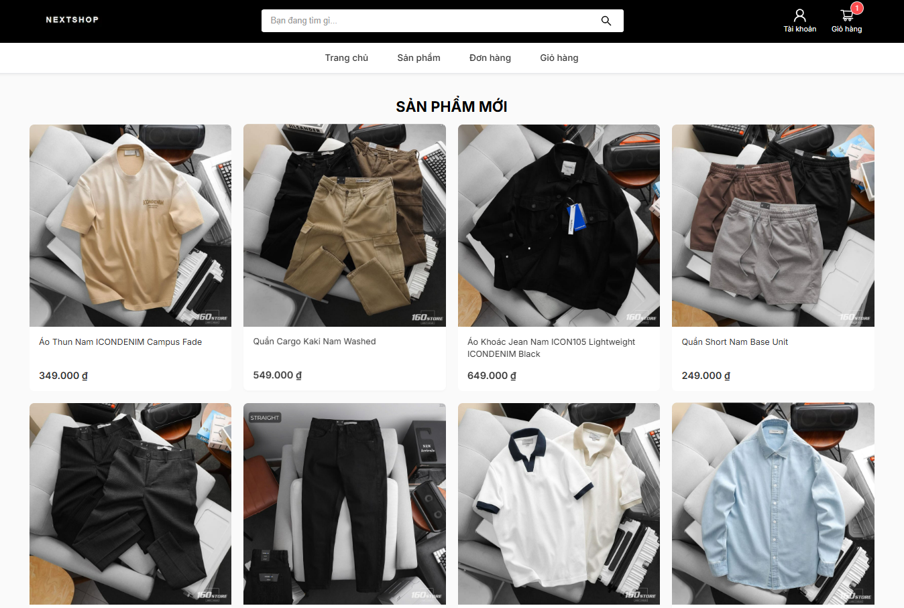
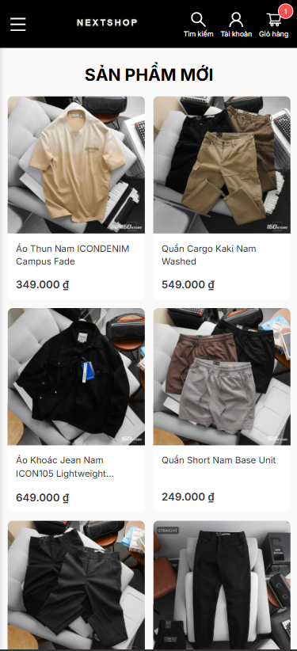
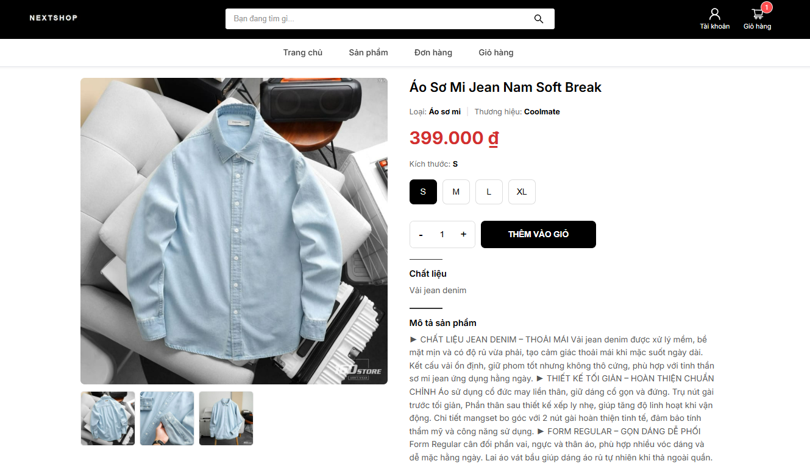
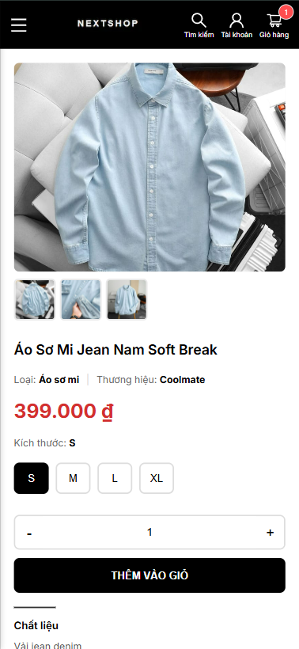
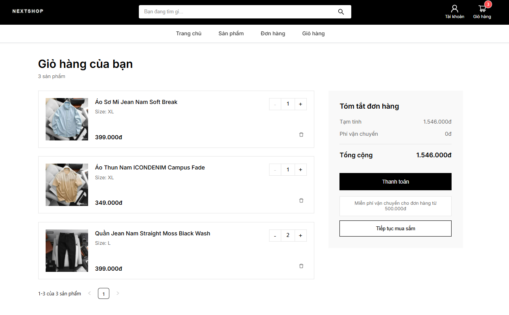
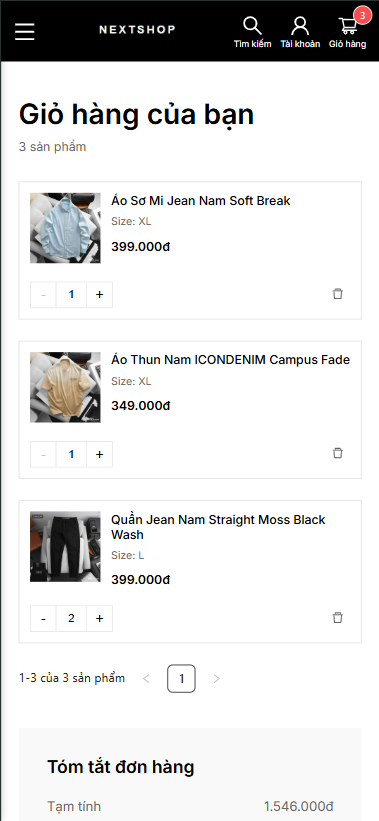
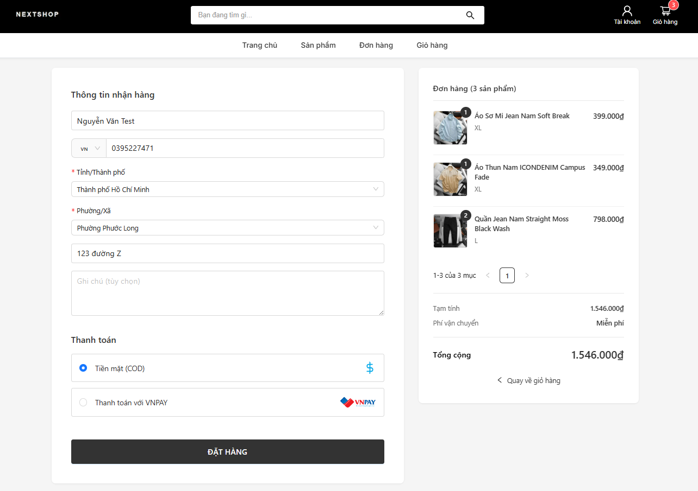

# Dự án tự học E-commerce Frontend

Frontend service cho hệ thống e-commerce, được xây dựng bằng NextJS.

## Environment

* Node.js: v20.14.0

## Tech Stack

* Framework: NextJS

## Backend Repository

Frontend sử dụng API từ backend service:

* Repository: <https://github.com/dangtu04/01-nestjs>

## Installation (Development)

1. Clone repository:

   ```bash
   git clone <repo-url>
   cd <project-folder>
   ```

2. Cài đặt dependencies:

   ```bash
   npm install
   ```

3. Cấu hình môi trường:

   * Tạo file `.env` từ file `.env.example`
   * Cập nhật các biến môi trường cần thiết (API endpoint, auth, ...)

4. Chạy project:

   ```bash
   npm run dev
   ```

## Notes

* Đảm bảo backend service đang chạy trước khi sử dụng các chức năng liên quan đến API
* Kiểm tra lại biến môi trường nếu không thể kết nối tới backend


## Screenshots

### Home Page

<p align="center">
  
  
</p>

### Product Detail

<p align="center">
  
  
</p>

### Cart

<p align="center">
  
  
</p>

### Checkout
